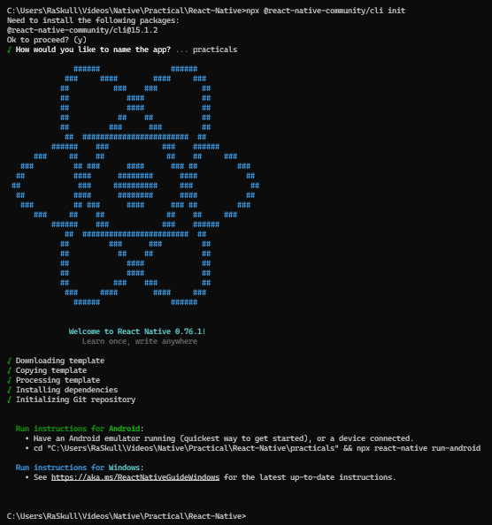

```bash
npx react-native init appName
```  
## OR
```bash
npx @react-native-community/cli init
# give the name in later prompt
```  
### Preview:  
  

## CD & Run  
```bash
cd practicals/
# Run Command
npx react-native run-android
```  