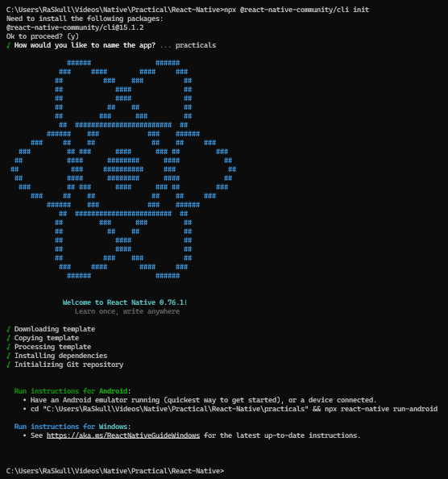

```bash
npx react-native init YourProjectName
# 🚨️ The `init` command is deprecated.
```
## OR
```bash
npx @react-native-community/cli init YourProjectName
```
### Preview:  
  

## CD & Run  
```bash
cd practicals/
# Run Command
npx react-native run-android
```
## Plug Device  
1. Open Developer Option (need to tap multiple times on Build Number)