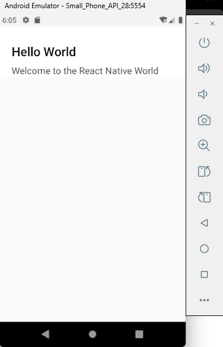

inside the main app directory  
```bash
./App.tsx
```  
inside `<view> </view>` element delet all Section & create own one  
```tsx
    <Section title="Hello World">
    <Text>Welcome to the React Native World</Text>
    </Section>
```  
about removing we can remove  
```tsx
        <Header />
```  
```tsx
import {
  Colors,
  Header,               // delete
  ReloadInstructions,   // delete
} from 'react-native/Libraries/NewAppScreen';
```  

save & run  
### Preview:  
  
